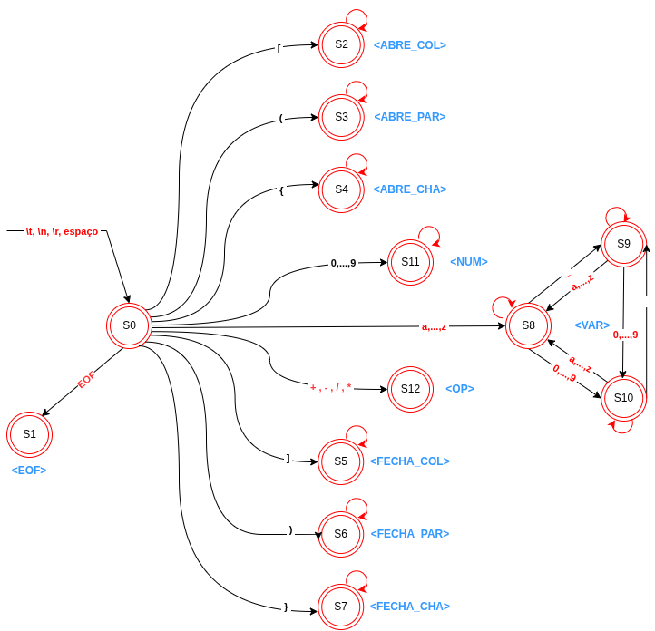

# Analisador Léxico - LFA

Projeto desenvolvido para a disciplina de **Linguagens Formais e Autômatos (LFA)** da **Universidade Federal do Espírito Santo (UFES)**.

## Integrantes

* Emily Wingler Gonçalves
* Fernanda Vieira Campos de Andrade

## Objetivo

Implementar um analisador léxico utilizando uma **Máquina de Moore** para reconhecer os elementos léxicos de uma linguagem simples.

O analisador percorre o arquivo de entrada caractere por caractere, classificando cada sequência reconhecida em um token válido. Caso seja encontrado um caractere inválido, uma exceção léxica é gerada e o processo é interrompido.

---

## Tokens Reconhecidos

| Token         | Descrição                                   |
| ------------- | ------------------------------------------- |
| `<ABRE_COL>`  | `[`                                         |
| `<FECHA_COL>` | `]`                                         |
| `<ABRE_PAR>`  | `(`                                         |
| `<FECHA_PAR>` | `)`                                         |
| `<ABRE_CHA>`  | `{`                                         |
| `<FECHA_CHA>` | `}`                                         |
| `<NUM>`       | Números inteiros                            |
| `<VAR>`       | Variáveis                                   |
| `<OP_ARIT>`   | Operadores aritméticos (`+`, `-`, `*`, `/`) |
| `<EOF>`       | Fim de arquivo                              |

### Expressões Regulares

```text
<ABRE_COL>  -> [
<ABRE_PAR>  -> (
<ABRE_CHA>  -> {
<FECHA_COL> -> ]
<FECHA_PAR> -> )
<FECHA_CHA> -> }
<NUM>       -> (0|...|9)+
<OP_ARIT>   -> + | - | * | /
<VAR>       -> (a|...|z)((a|...|z)|(0|...|9)|_)*
<EOF>       -> fim de arquivo
```

---

## Máquina de Moore

A implementação do analisador foi baseada em uma Máquina de Moore responsável por controlar os estados de reconhecimento dos tokens.

<p align="center">
  
</p>

---

## Estrutura do Projeto

```text
.
├── main.cpp
├── Token.h
├── ErroLexico.h
├── AnalisadorLexico.h
├── AnalisadorLexico.cpp
├── entrada.txt
└── assets
    └── maquina-moore.png
```

---

## Bibliotecas Utilizadas

```cpp
#include <iostream>
#include <string>
#include <fstream>
#include <stdexcept>
```

### Finalidade

* `iostream` → Entrada e saída de dados.
* `string` → Manipulação de cadeias de caracteres.
* `fstream` → Leitura de arquivos.
* `stdexcept` → Tratamento de exceções.

---

## Compilação

Utilizando o compilador G++:

```bash
g++ main.cpp AnalisadorLexico.cpp -o analisador
```

---

## Execução

```bash
./analisador entrada.txt
```

ou, no Windows:

```bash
analisador.exe entrada.txt
```

---

## Exemplo de Entrada

```text
[2 * ( 4 + 3 )]
```

## Saída Esperada

```text
<ABRE_COL>
<NUM>
<OP_ARIT>
<ABRE_PAR>
<NUM>
<OP_ARIT>
<NUM>
<FECHA_PAR>
<FECHA_COL>
<EOF>
```

---

## Tratamento de Erros

O projeto possui uma classe específica para erros léxicos (`ErroLexico`).

Exemplo:

### Entrada

```text
_contador + 10
```

### Saída

```text
Caractere invalido: _
Falha na analise lexica.
```

Outro exemplo:

### Entrada

```text
[ 20 * ( valor_total @ 3 ) ]
```

### Saída

```text
Caractere invalido: @
Falha na analise lexica.
```

---

## Funcionamento Geral

1. O arquivo de entrada é aberto e carregado.
2. O analisador percorre cada caractere da entrada.
3. A Máquina de Moore identifica o estado correspondente.
4. O token reconhecido é retornado.
5. O processo continua até o reconhecimento de `<EOF>`.
6. Caso um caractere inválido seja encontrado, uma exceção léxica é lançada.

---

## Resultados

Os testes realizados demonstraram o correto reconhecimento de:

* Números inteiros;
* Variáveis;
* Operadores aritméticos;
* Delimitadores;
* Estruturas aninhadas;
* Tratamento de erros léxicos.

O analisador apresentou comportamento consistente tanto para entradas válidas quanto para entradas contendo símbolos inválidos.

---

## Disciplina

**Linguagens Formais e Autômatos (LFA)**

Universidade Federal do Espírito Santo (UFES)
Centro Universitário Norte do Espírito Santo (CEUNES)
